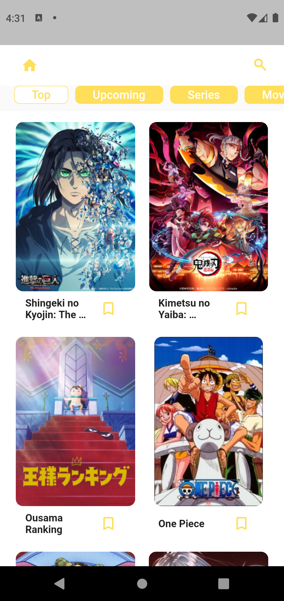

<div align='center'>

 

# Weebify
> Flutter App to get Anime and Manga Details

   

</div>

## Getting Started

### Follow the steps to install flutter from [here](https://flutter.dev/docs/get-started/install/)

After installing flutter, follow these steps to get started:

> Clone the repository:

```sh
git clone https://github.com/alensaito1/weebify.git
cd weebify
```
> Install the dependencies:
```sh
flutter pub get
```
> Running the app:
```sh
flutter run
```
> Building the app:
```sh
flutter build <apk|appbundle|aar|bundle|web|windows>
```

# Resources

- [Lab: Write your first Flutter app](https://flutter.dev/docs/get-started/codelab)
- [Cookbook: Useful Flutter samples](https://flutter.dev/docs/cookbook)
- [Online Documentation](https://flutter.dev/docs)

This Project uses [Jikan.moe](https://jikan.moe/) to get the anime and manga details.
